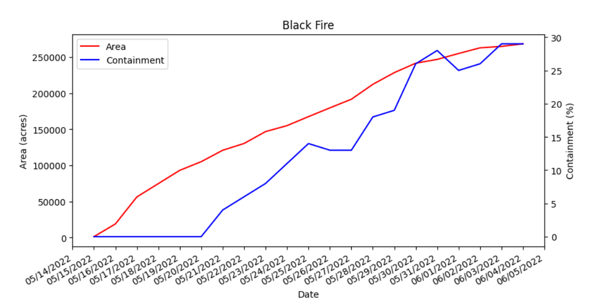

# InciWeb timeseries scraper



I wanted to create a visualization of the scale of the ongoing wildfires in New Mexico, but
could not find a source of timeseries data for them.

This library scrapes the HTML of the [Incident Information System](https://inciweb.nwcg.gov/)
and applies (rough) NLP in order to extract the area and containment of a fire given its
incident ID.

It also supports invocation through the command line to plot the area and containment of a
single fire, or dump that fire's data to CSV.

## Usage: library

```py
from inciweb_timeseries_scraper import get_all_data

data = get_all_data(8103)
# data now contains (date, area, containment) tuples
```

The ID 8103 comes from the URL of the incident page, e.g.
[https://inciweb.nwcg.gov/incident/8103/](https://inciweb.nwcg.gov/incident/8103/).

## Usage: command line

```sh
# display a plot of the area and containment time series
$ python3 -m inciweb_timeseries_scraper plot 8103

# plot to file
$ python3 -m inciweb_timeseries_scraper plot 8103 -o black_fire.png

# save data to csv
$ python3 -m inciweb_timeseries_scraper csv 8103 -o black_fire.csv
```

## Caveats:

- The data posted on InciWeb comes from different sources and the NLP techniques I'm using rely on
some heuristics that might not work for all events.
- This will break immediately if the HTML of InciWeb changes.
- Making many automated requests like this may eventually cause you to get blocked or throttled.
- Some posts that are not actually daily updates may have spurious data extracted from them and thus will
  need to be manually removed.